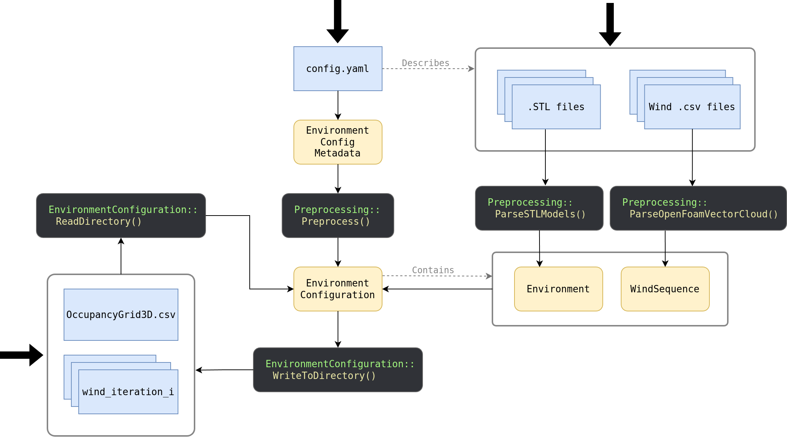
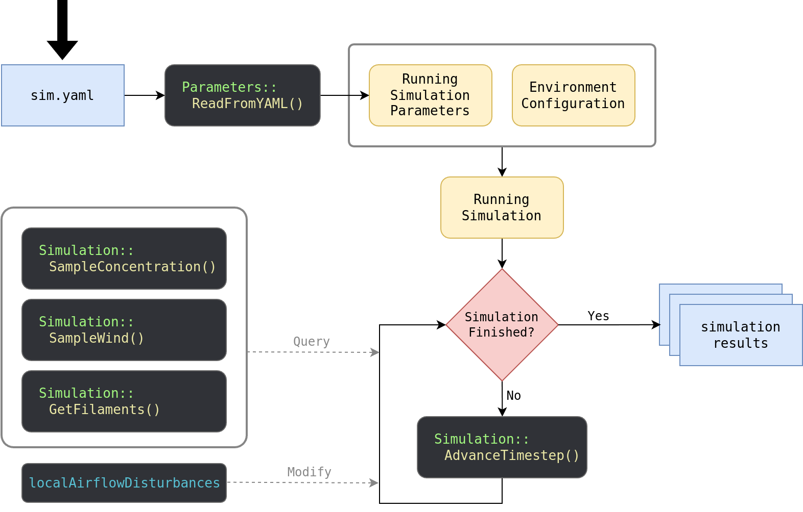
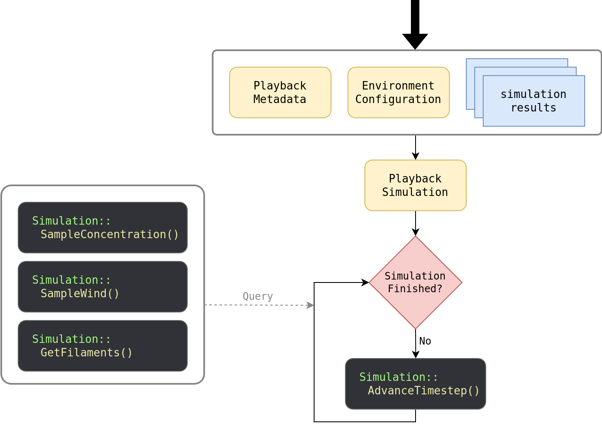

# Tutorial

You can use the [example project](../example_project/) to learn how gaden works.

## Environment Configuration
The first step in running a simulation is to create an environment configuration, which represents a combination of environment geometry and airflow. You can build an `EnvironmentConfiguration` object in three ways, described by the following flow chart:

- Read a `config.yaml` metadata file that describes the configuration (see the example project) and call `Preprocess()`.
- Manually and separately preprocess the environment and the wind files.
- Read an already preprocessed configuration (`OccupancyGrid3D.csv` and `wind` folder) from disk.

 

## Simulations
Once you have the `EnvironmentConfiguration`, you can define as many simulations as you like to take place in it. A `Simulation` references a specific `EnvironmentConfiguration`, and establishes all the parameters relative to the gas dispersal: source position, gas type, release rate, temperature, etc. 

There are two types of `Simulation` objects: a `RunningSimulation` (which *generates* new results), and a `PlaybackSimulation` (which *reads* existing results). To begin with, you will have no choice but to use a `RunningSimulation`, but once that simulation is complete (and provided you have configured it to save its results to disk), you will be able to create a `PlaybackSimulation` to read those results back.

### Running Simulation
The general workflow for creating and using a `RunningSimulation` is as follows:

 

The main advantage of a `RunningSimulation` is that, since it is ongoing, you can make modifications to it. The main disadvantage is that its computational cost scales with the number of active filaments, potentially making them slow for very high numbers of filaments. However, with modern gaden, if one disables the `saveResults` parameter, the computational cost remains quite low even for very high numbers of filaments, since compressing the results is the most expensive part of the simulation.

### Playback Simulation
A `PlaybackSimulation` can use the results from a `RunningSimulation` like this:

 

It is also possible to play back multiple simulations at the same time (in lockstep) with a `Scene`:

 

This requires that all simulations in the scene use the same `EnvironmentConfiguration`. Creating a `Scene` is an easy way to handle multi-source simulations, including the case where there are multiple types of gas in the environment at the same time.